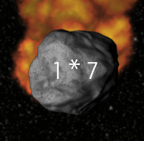
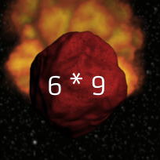

# How To Play

Taken from `assets/about.txt`:

Your main goal is to protect a planet and avoid having it be destroyed by asteroids 
and obtain the highest score possible.

At the bottom of the screen you have a space where you can input your 'answer' 
to an asteroid on the screen. If you get it correct, then the asteroid will be 
destroyed. However, if you are too slow then the aasteroid will hit the planet 
and explode and you will lose one hit point. You start with 5 hit points.

As you destroy more asteroids, you will eventually 'level up' and more asteroids 
will spawn at a faster rate also fall down at a faster rate. Additionally, 
'red asteroids' will spawn which are extra dangerous - if you enter a wrong answer 
you will take one hit of damage and if it makes it to the bottom of the screen, 
the asteroid will destroy the planet and you will lose! Be careful!

See how high of a score you can get before the asteroids overwhelm you.

Good luck and enjoy! :)

An asteroid.

A red asteroid, be careful!
