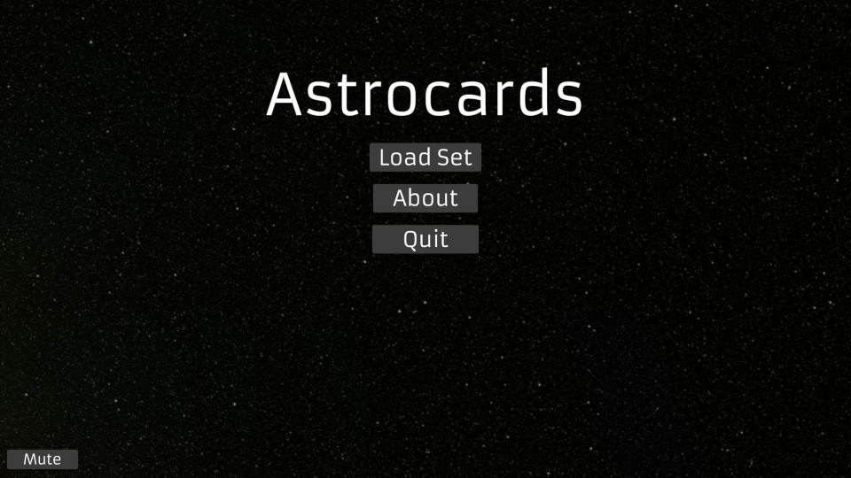
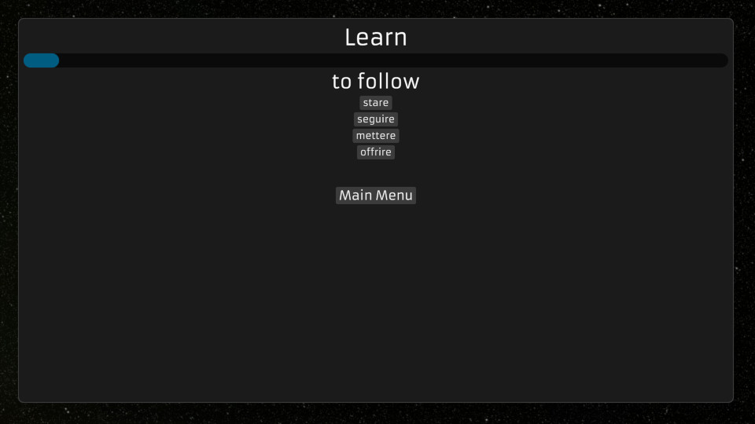
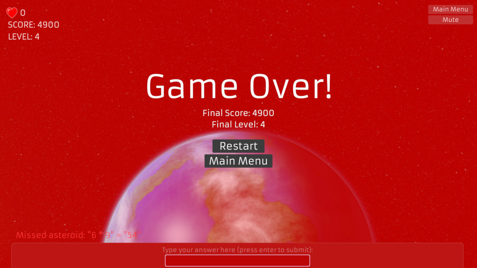

# Astrocards

Astrocards is a fun little flashcard game that I have created in order to help 
with memorization of things such as vocabulary, times tables, and more! 

The motivation for this game was that if you had to quickly answer flashcards 
in order to gain points and avoid getting a game over, then you would slowly 
get better after many rounds of repetition and you would slowly improve over 
time - and it hopefully should be somewhat entertaining at the same time!

## How to play

See `HOWTOPLAY.md` for details on how to play Astrocards.

[How to play](HOWTOPLAY.md)

## Screenshots



The main menu screen.


A game of asteroids.



A screenshot from the 'learn' mode.



Game over!

## About

The main motivation for this game was to create a means for me to learn Italian
in a fun and interesting manner.

Most of the Italian vocabulary comes from Professor Dave Explain's Italian
course: [Click here for YT playlist](https://www.youtube.com/playlist?list=PLybg94GvOJ9FsOX3hUQsIm5NOJ2H6zh3a)

It can also be used to study other things.

## Compile

Debug:
```
cargo build
```

Release:
```
cargo build --release
```

## License

Source code: GPLv3

For artwork/sound effects, see `assets/credits.txt` for the original authors 
and the appropriate license.
